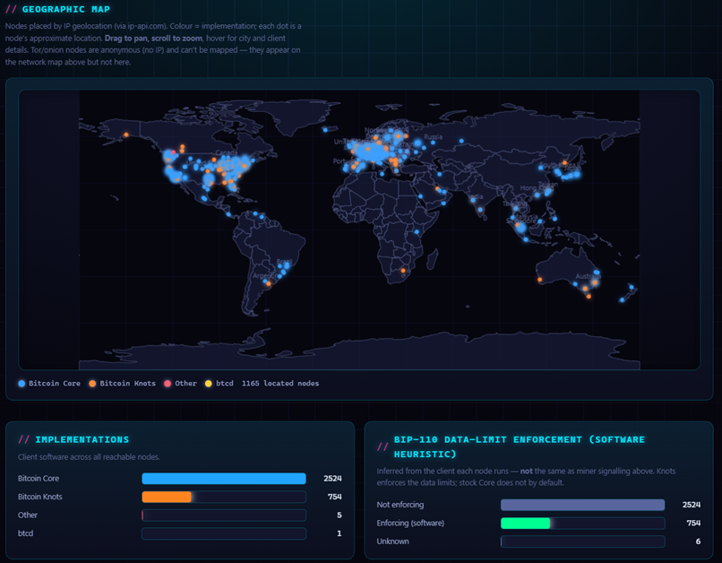

# bip110-crawler

A Rust crawler that maps the Bitcoin peer-to-peer network from your own node and
renders a live, interactive dashboard of node implementations, versions, and
[**BIP-110**](https://github.com/bitcoin/bips/blob/master/bip-0110.mediawiki)
("Reduced Data Temporary Softfork") readiness.

🌐 **Live instance: [bip110.xyz](https://bip110.xyz)** · [Why support BIP-110? →](https://bip110.xyz/why)

 



## Features

- **Depth-first P2P crawl** over clearnet **and Tor** — real `version`/`verack`
  handshakes to learn each peer's exact client and version, then `getaddr` to expand
  the frontier.
- **Authoritative BIP-110 signalling** — scans your node's recent block headers for
  version-bit 4 and tracks progress toward the 55%-of-2016-blocks lock-in.
- **Per-node readiness** — detects BIP-110-ready builds from the peer's user agent.
- **Interactive report** — a 3D force-directed network map, an IP-geolocated world
  map, and labelled charts. Opens standalone from `file://`, or served live from a
  built-in SQLite-backed API.
- **Resumable & continuous** — persist and resume crawl state, run on a loop with
  periodic snapshots, and accumulate history across runs.
- **Read-only & self-hosted** — only read-only P2P/RPC calls; host it on your own
  domain via a Cloudflare Tunnel with data never leaving your machine.

## How BIP-110 status is measured

BIP-110 activates when **miners set bit 4 in the block `version`** (lock-in at 55% of
2016 blocks) — it is *not* advertised by ordinary nodes in the P2P handshake. The
report keeps two distinct things separate:

- **Miner signalling (authoritative)** — measured by scanning your node's recent block
  headers for bit 4. This is the real activation signal.
- **Node readiness** — detected from a peer's user agent: builds tagged `+bip110` /
  `UASF-BIP110`, or mainline Bitcoin Knots builds dated on/after the release that
  merged BIP-110, are marked **ready**. Override the mapping with `--rules`.

Peer edges come from `getaddr` gossip — *reachability* ("A knows about B"), not
confirmed live links (the same technique crawlers such as Bitnodes use).

## Quick start

```sh
cargo build --release

# Crawl from your own node (cookie auth shown; or use --rpc-user / --rpc-pass)
bip110-crawler --rpc-url http://127.0.0.1:8332 --rpc-cookie ~/.bitcoin/.cookie \
  --max-depth 2 --max-nodes 500

# then open report/index.html
```

No node of your own? Seed directly (this skips the signalling scan):

```sh
bip110-crawler --seed seed.bitcoin.sipa.be
```

## Live dashboard (SQLite + API)

For a full crawl, write to SQLite and serve the page + API. The crawler and server run
side by side — WAL mode makes reads and writes concurrent:

```sh
# Terminal 1 — continuous, resumable crawl over clearnet + Tor, into SQLite:
bip110-crawler --rpc-url http://127.0.0.1:8332 --rpc-user U --rpc-pass P \
  --tor-proxy 127.0.0.1:9050 --exhaustive --geolocate \
  --db crawl.db --state-file crawl-state.json --snapshot-interval 30

# Terminal 2 — serve the dashboard + API from that DB:
bip110-crawler --serve --db crawl.db --port 8080   # http://127.0.0.1:8080
```

The page loads instantly, then polls `GET /api/report` (bounded set for the
maps/charts) and `GET /api/nodes?q=&impl=&reachable=1&sort=&limit=&offset=` (filtered,
paginated rows). Only **reachable** nodes are exposed; the full set (including
unreachable gossip addresses) stays in the DB and state file.

**Host it on your own domain** with a free
[Cloudflare Tunnel](https://developers.cloudflare.com/cloudflare-one/connections/connect-networks/) —
HTTPS, no VPS, no port-forwarding, data stays local:

```sh
cloudflared tunnel --url http://localhost:8080   # temporary URL to test
# (or run a named tunnel routed to your domain — see the Cloudflare docs)
```

## Options

| Flag | Default | Meaning |
|------|---------|---------|
| `--network` | `main` | `main`, `test`, `signet`, or `regtest` |
| `--rpc-url` | – | Bitcoin Core JSON-RPC URL (omit to skip RPC) |
| `--rpc-cookie` / `--rpc-user` + `--rpc-pass` | – | RPC auth |
| `--seed <ip:port>` | – | Extra seed peer(s); repeatable |
| `--max-depth` | `2` | DFS depth (0 = seeds only) |
| `--max-nodes` | `500` | Stop after this many nodes |
| `--exhaustive` | off | Unlimited depth + nodes — crawl the whole reachable network |
| `--threads` / `--tor-threads` | `64` / `48` | Concurrent clearnet / onion workers (separate pools) |
| `--tor-proxy <host:port>` | – | SOCKS5 proxy (e.g. `127.0.0.1:9050`) to also crawl onion nodes |
| `--retries` | `1` | Extra connection attempts before marking a peer unreachable |
| `--connect-timeout` / `--io-timeout` | `8` / `10` s | Network timeouts (higher connect = fewer false "unreachable") |
| `--signal-window` / `--signal-bit` | `2016` / `4` | Blocks to scan / block-version bit for BIP-110 signalling |
| `--rules <file.json>` | – | Custom user-agent → stance mapping (JSON array of `{user_agent_contains, stance}`) |
| `--geolocate` | off | Add a world map by geolocating IPs (**sends peer IPs to ip-api.com**) |
| `--geo-cache <path>` | `geo-cache.json` | Cache of resolved IPs; only new IPs hit the API |
| `--history-file <path>` | – | Accumulate results across crawls (offline nodes persist) |
| `--state-file <path>` | – | Persist + resume crawl state; restart continues where it left off |
| `--snapshot-interval <secs>` | `0` | Rewrite the report every N seconds *during* the crawl |
| `--watch` / `--interval` | off / `300` | Re-crawl on a loop, rewriting the report each cycle |
| `--report-max-nodes` | `3000` | Cap nodes in the static report so the page stays loadable (0 = unlimited) |
| `--db <path>` | – | Write the full crawl to a SQLite DB (enables the `--serve` API) |
| `--serve` / `--port` | off / `8080` | Run the web/API server (reads `--db`) instead of crawling |
| `--out <dir>` | `report` | Output directory for the static report |

## Notes & limits

- **Privacy:** `--geolocate` sends peer IP addresses to ip-api.com (free tier,
  HTTP-only, rate-limited; the crawler batches and paces requests). Results are cached
  so repeat runs barely touch the API.
- **Unreachable peers are expected.** `getaddr` returns each peer's *address book*
  (nodes it has heard of), most of which aren't accepting connections right now — on
  mainnet typically only ~15–20% are reachable at any moment. Raise the ratio with
  `--retries` and a longer `--connect-timeout`. The report shows reachable nodes only.
- **Tor.** Onion peers (from `addrv2` / BIP155) are dialed via the SOCKS5 proxy in a
  separate worker pool, so slow circuits never block clearnet progress. They have no
  IP, so they appear on the network map and table (tagged "Tor") but not the geo map.
- **Read-only.** The crawler only sends read-only P2P messages and read-only RPC calls.

## Project layout

| File | Role |
|------|------|
| `src/rpc.rs` | JSON-RPC client: version, peers, block-version signalling scan |
| `src/p2p.rs` | Hand-rolled Bitcoin P2P: handshake, `getaddr`, `addr`/`addrv2` parsing |
| `src/crawler.rs` | Depth-first crawl with bounded, split clearnet/onion worker pools |
| `src/node.rs` | Node model, user-agent classification, BIP-110 assessment |
| `src/db.rs` / `src/serve.rs` | SQLite storage and the embedded HTTP/API server |
| `src/report.rs` | JSON + the self-contained interactive HTML dashboard |
| `src/main.rs` | CLI and orchestration |

## License

MIT
